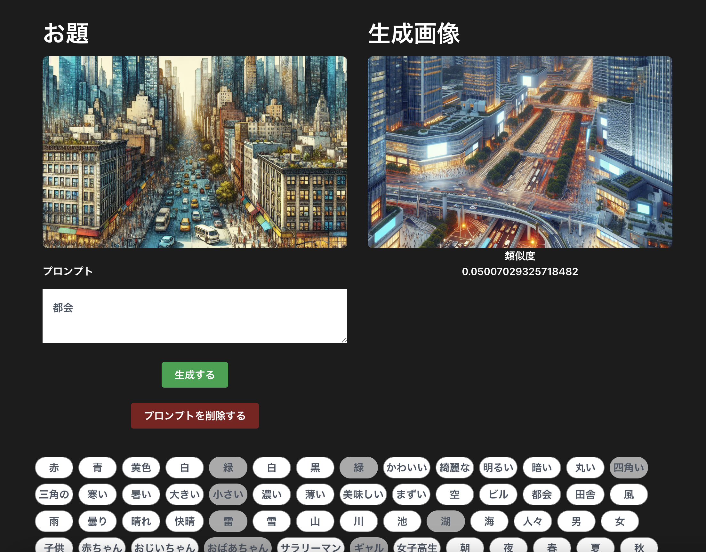

# DALL-E-3 AI-APP

Open AI の DALL-E-3 の API を利用した画像生成 AI から生成した画像をお題の画像と比較して類似度を競うゲーム

# DEMO



# Requirement

- Python 3.11.6
- Flask 2.3.3
- node v20.9.0

# Installation

```bash
pip install openai
pip install scikit-image
pip install Flask
```

# Note

- OpenAI の API キー作成には課金が必要です。
- 1 枚の画像生成で 0.04 ドル（約 6 円）課金されます。

# Infrastructure


<br>

# Language and FrameWork


